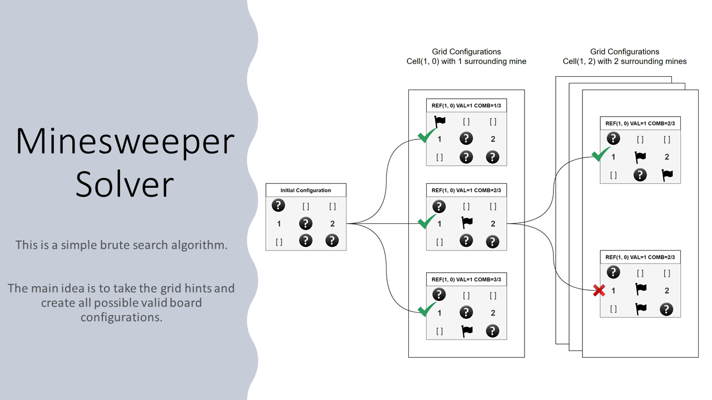

# minesweeper-hate-gang
a very simple & inefficient implementation of a minesweeper solver coded
in python.



## Installation

Install this application using pip directly referencing the dev branch from github OR just:

```commandline
$ pip install -e minesweeper
```

Test by running: `minesweeper --help` or `python -m minesweeper --help`

## CLI Usage

Provide a grid with the following cell types:
* `[ ]`: empty cell.
* `[?]`: non-visible cell.
* `[*]`: flagged cell.
* `[i]`: cell with a number hint between 1 to 8 (e.g., `[3]`, `[1]`).

Consider the popular [XKCD commic "Mine Captcha"](https://xkcd.com/2496/). 
We can represent that board configuration as following:

```text
[2] [?] [1] [?]
[?] [?] [3] [?]
[3] [?] [?] [?]
[?] [1] [?] [1]
```

You can execute the program by passing the grid & timeout as arguments.

**Example 1**:

```commandline
$ minesweeper --timeout 3 --grid """
[3] [?] [2] [?]
[?] [?] [ ] [?]
"""

```

Expected output:

```text
[3] [*] [2] [ ]
[*] [*] [ ] [ ]
```

**Example 2**:


```commandline
$ minesweeper --timeout 3 --grid """
[2] [?] [1] [?]
[?] [?] [3] [?]
[3] [?] [?] [?]
[?] [1] [?] [1]
"""
```

Expected output:

```text
[2] [ ] [1] [ ]
[*] [*] [3] [ ]
[3] [*] [ ] [*]
[ ] [1] [ ] [1]
```

## Package Usage

Once installed, you can also use this application as a python library.

Create a simple board:
```python
from minesweeper.board import Grid, Cell

my_grid = Grid(
    values=[
        [Cell.num(2), Cell.unk(), Cell.num(1), Cell.unk()],
        [Cell.unk(), Cell.unk(), Cell.num(3), Cell.unk()],
        [Cell.num(3), Cell.unk(), Cell.unk(), Cell.unk()],
        [Cell.unk(), Cell.num(1), Cell.unk(), Cell.num(1)]
    ]
)

my_grid.show()
```

You can solve a grid by using the `Solver` class:

```python
from minesweeper.solver import Solver

solver = Solver(gird=my_grid)
solver.run(timeout=10)

if solver.finished():
    solution = solver.final_state
    solution.show()
```

## Disclaimer!

There are lot's of corner cases still be to implemented. This repo was originally created
to complement a twitter post, so will probably not get updated any time soon hehe.
